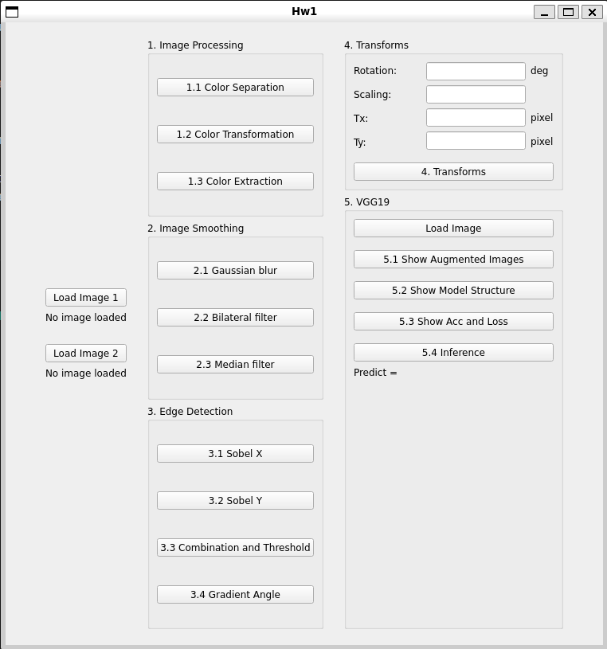

# 2023_Introduction_to_Image_Processing-Computer_Vision-and_Deep_Learning_HW1_in_NCKU

This is a repo for solving HW1 in 2023 Introduction to Image Processing, Computer Vision, and Deep Learning courses in NCKU.

## Prerequisite

* Python 3.8

* Pip

## Environment

* Windows 11
* Ubuntu 20.04 WSL

## Get Started

Use

```bash
$ git clone https://github.com/dodo920306/2023_Introduction_to_Image_Processing-Computer_Vision-and_Deep_Learning_HW1_in_NCKU.git
$ pip install -r requirements.txt
```

to clone the repo and install the prerequisites.

Run

```bash
$ ldd ~/.local/lib/python3.8/site-packages/PyQt5/Qt5/plugins/platforms/libqxcb.so | grep "not found"
```

to check if there are dependent shared libraries missing. It's usual that there's a lot of them.

Use

```bash
$ sudo apt update && sudo apt install <missing shared libraries> -y
```

to collect them.

For example, if you get

```bash
$ ldd ~/.local/lib/python3.8/site-packages/PyQt5/Qt5/plugins/platforms/libqxcb.so | grep "not found"
    libxcb-icccm.so.4 => not found
    libxcb-image.so.0 => not found
```

, run

```bash
$ sudo apt update && sudo apt install libxcb-icccm4 libxcb-image0 -y
```

in response.

The environment I used for develop this is WSL on Windows 11. If you're doing the same, please use

```bash
$ ipconfig
```

on Windows host to check its IP for the WSL.

You should be able to ping that IP from WSL. If you can't, please run

```bash
$ New-NetFirewallRule -DisplayName "WSL" -Direction Inbound -InterfaceAlias "vEthernet (WSL)" -Action Allow
```

as the administrator on Windows and try again.

Finally, run

```bash
$ python main.py
```

to start the program. You should see the window pop up on your screen.

You may encouter `Segmentation fault` when closing the window, it's normal. If you know how to fix it, please send pull request for it because I'm not sure how to solve that.

If you can actually ping Windows from WSL but still can't run main.py, please update your wsl, restart it, and try again.

## Functionality

Once you run main.py successfully, you should see some UI like this



As you can see, the features are divided into 5 main parts: Image Processing, Image Smoothing, Edge Detection, Transforms, and VGG19.

### Image Processing

There are 3 buttons can be clicked providing 3 different features:

1. Color Separation

    Click this button to get 3 popup windows showing R, G, B images separated from the image uploaded with the load-image-1 button.

2. Color Transformation

    Click this button to get 2 popup windows showing grayscale images converted with perceptually weighted formula and average weighted formula respectively from the image uploaded with the load-image-1 button.

3. Color Extraction

    Click this button to get 2 popup windows showing yellow/green part of the image uploaded with the load-image-1 button and the image after getting extracted the part.

run

```bash
$ python Image_Processing.py
```

to get this part of UI independently.

### Image Smoothing

There are 3 buttons can be clicked providing 3 different features:

1. Gaussian blur

    Click this button to get a popup window showing the image uploaded with the load-image-1 button and a track bar. Slide the track bar to change the radius of the Gaussian kernel, and the image will change correspondingly.

2. Bilateral Filter

    Click this button to get a popup window showing the image uploaded with the load-image-1 button and a track bar. Slide the track bar to change the radius of the Bilateral kernel, and the image will change correspondingly.

3. Median Filter

    Click this button to get a popup window showing the image uploaded with the load-image-2 button and a track bar. Slide the track bar to change the radius of the Median kernel, and the image will change correspondingly.

run

```bash
$ python Image_Smoothing.py
```

to get this part of UI independently.


### Edge Detection

There are 4 buttons can be clicked providing 4 different features:

1. Sobel X

    Click this button to get a popup window showing the Sobel X image for the image uploaded with the load-image-1 button.

2. Sobel Y

    Click this button to get a popup window showing the Sobel Y image for the image uploaded with the load-image-1 button.

3. Combination and Threshold

    Click this button to get 2 popup windows showing the image conbining Sobel X image and Sobel Y image for the image uploaded with the load-image-1 button and the image after setting threshold on the first image.

4. Gradient Angle

    Click this button to get 2 popup windows showing the image conbining Sobel X image and Sobel Y image for the image uploaded with the load-image-1 button but only parts whose Gradient Angle is between 120 and 180 degrees and between 210 and 310 degrees.

run

```bash
$ python Edge_Detection.py
```

to get this part of UI independently.

### Transforms

Click the button to get a popup window showing the image uploaded with the load-image-1 button but rotated and scaled by the input number (default values are 0 and 1) with the center in (240, 200) and translated with input number Tx and Ty.

run

```bash
$ python Edge_Detection.py
```

to get this part of UI independently.

### VGG19

There are 5 buttons can be clicked providing 4 different features:

1. show Augmented Images

    Click the button to get a popup window showing the augmented images with labels (filenames) from the `Q5_image\Q5_1` directory under the project directory with 9 pictures inside.

    The augmented techniques used here are

    1. transforms.RandomHorizontalFlip()

    2. transforms.RandomVerticalFlip()

    3. transforms.RandomRotation(30)

2. Show the Structure of VGG19 with BN

    Click the button to get structure of VGG19 with BN that will be used in next features.

3. Show Training/Validating Accuracy and Loss

    Click the button to get a popup window with the image showing the training/validating accuracy and loss of the model if you've trained one.

4. Inference

    1. Click the "load image" button to load the image you want your model to infer in.
    2. Click the "Inference" button to get the inference result of your model.

run

```
$ python VGG19.py
```

and type 1 to get this part of UI independently, or type 2 to train your own model.
